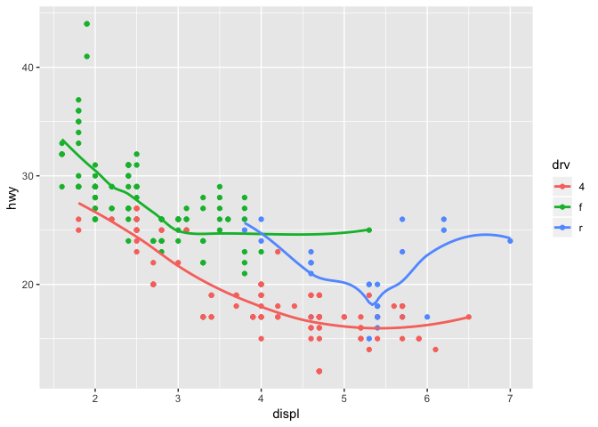
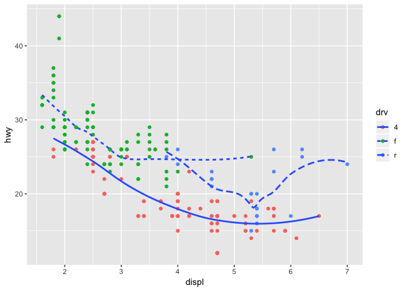
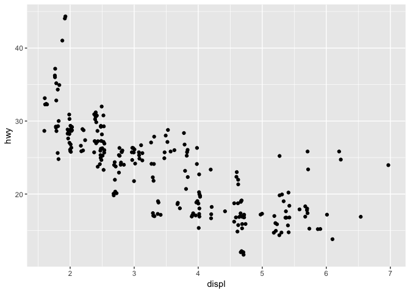

Homework 2: ggplot
================
2019-03-08

``` r
library(tidyverse)
```

    ## ── Attaching packages ───────────────────────────────────────────────────────────── tidyverse 1.2.1 ──

    ## ✔ ggplot2 3.1.0       ✔ purrr   0.3.1  
    ## ✔ tibble  2.0.1       ✔ dplyr   0.8.0.1
    ## ✔ tidyr   0.8.3       ✔ stringr 1.4.0  
    ## ✔ readr   1.3.1       ✔ forcats 0.4.0

    ## ── Conflicts ──────────────────────────────────────────────────────────────── tidyverse_conflicts() ──
    ## ✖ dplyr::filter() masks stats::filter()
    ## ✖ dplyr::lag()    masks stats::lag()

-   Take the first faceted plot in this section:

``` r
ggplot(data = mpg) + 
  geom_point(mapping = aes(x = displ, y = hwy)) + 
  facet_wrap(~ class, nrow = 2)
```


``` r
ggplot(data = mpg) + 
  geom_point(mapping = aes(x = displ, y = hwy, colour = class))  
```

 What are the advantages to using faceting instead of the colour aesthetic? What are the disadvantages? How might the balance change if you had a larger dataset?

Advantages to using faceting: each class has own plot, so it is easy to understand the hwy/displ dependence for each class.All population do not overlap. In case we have not a little data, empty plots could occur.

Disadvantages to using faceting: we use separate plot for each class, so it could be difficult to analyze the hwy/displ dependence among classes. Colour aesthetic provide us one plot but it is difficult to understand hwy/displ dependence for each class.

The overplotting could be occur due to larger dataset

-   Recreate the R code necessary to generate the following graphs.

``` r
knitr::include_graphics(paste0("plots/fig", 1:6, ".png"))
```


Nb!

Last plot could not recreate.

``` r
ggplot(data = mpg) + 
  geom_point(mapping = aes(x = displ, y = hwy)) +
  geom_smooth(mapping = aes(x = displ, y = hwy), se = FALSE)
```

    ## `geom_smooth()` using method = 'loess' and formula 'y ~ x'


``` r
ggplot(data = mpg) + 
  geom_point(mapping = aes(x = displ, y = hwy)) +
  geom_smooth(mapping = aes(x = displ, y = hwy, group = drv), se = FALSE)
```

    ## `geom_smooth()` using method = 'loess' and formula 'y ~ x'


``` r
ggplot(data = mpg) + 
  geom_point(mapping = aes(x = displ, y = hwy, colour = drv )) +
  geom_smooth(mapping = aes(x = displ, y = hwy, group = drv, colour = drv), se = FALSE)
```

    ## `geom_smooth()` using method = 'loess' and formula 'y ~ x'


``` r
ggplot(data = mpg) + 
  geom_point(mapping = aes(x = displ, y = hwy, colour = drv)) +
  geom_smooth(mapping = aes(x = displ, y = hwy), se = FALSE)
```

    ## `geom_smooth()` using method = 'loess' and formula 'y ~ x'



``` r
ggplot(data = mpg) + 
  geom_point(mapping = aes(x = displ, y = hwy, colour = drv)) +
  geom_smooth(mapping = aes(x = displ, y = hwy, group = drv, linetype = drv), se = FALSE)
```

    ## `geom_smooth()` using method = 'loess' and formula 'y ~ x'


``` r
ggplot(data = mpg, mapping = aes(x = displ, y = hwy)) + 
  geom_point(size = 4, colour = "white") +
  geom_point(aes(colour = drv))
```



``` r
ggplot(data = mpg, mapping = aes(x = displ, y = hwy, fill = drv)) + 
  geom_point(shape = 21, stroke = 1.5, colour = "white") 
```


-   Compare and contrast geom\_jitter() with geom\_count().

Geom\_jitter() adds a small amount of random variation to the location of each point, and is a useful way of handling overplotting caused by discreteness in smaller datasets.

Geom\_count() maps the count to point area. It useful when you have discrete data and overplotting.

``` r
ggplot(data = mpg) + 
  geom_jitter(mapping = aes(x = displ, y = hwy)) 
```



``` r
ggplot(data = mpg) + 
  geom_count(mapping = aes(x = displ, y = hwy)) 
```


-   What does the plot below tell you about the relationship between city and highway mpg (fuel consumption)? Why is coord\_fixed() important? What does geom\_abline() do?

The plot demonstartes that consumption of petrol on highway is less than in city. Auto saab pikkema distantsi syita maanteel.

Coord\_fixed() is important because it represents the number of units on the y-axis equivalent to one unit on the x-axis.

Geom\_abline() adds reference lines to a plot diagonal.

``` r
ggplot(data = mpg, mapping = aes(x = cty, y = hwy)) +
  geom_point() + 
  geom_abline() +
  coord_fixed()
```


-   What is the default geom associated with stat\_summary()?

Geom = "geom\_pointrange" that represents a vertical interval defined by x, ymin and ymax. Each case draws a single graphical object.

``` r
ggplot(data = diamonds) + 
  stat_summary(
    mapping = aes(x = cut, y = depth),
    fun.ymin = min,
    fun.ymax = max,
    fun.y = median
  )
```


How could you rewrite the previous plot to use that geom function instead of the stat function?

``` r
ggplot(data = diamonds)+
  geom_pointrange(
    mapping = aes(x = cut, y = depth),
    fun.ymin = min, 
    fun.ymax = max, 
    fun.y = median, 
    stat = "summary"
  )
```


-   What does geom\_col() do? How is it different to geom\_bar()?

Geom\_col() is a type of chart taht uses stat\_identity(): it leaves the data as is.

Geom\_bar() makes the height of the bar proportional to the number of cases in each group. If you want the heights of the bars to represent values in the data, use geom\_col() instead. geom\_bar() uses stat\_count() by default: it counts the number of cases at each x position.

-   What variables does compute stat\_smooth ? What parameters control its behaviour?

Stat\_smooth computes: y - predicted value, ymin - lower pointwise confidence interval around the mean, ymax - upper pointwise confidence interval around the mean, se - standard error.

-   In our proportion bar chart, we need to set group = 1. Why? In other words what is the problem with these two graphs?

We also need to set "group = 1" to get relative proportions of categories in our dataset.

``` r
ggplot(data = diamonds) + 
  geom_bar(mapping = aes(x = cut, y = ..prop..))
```


``` r
ggplot(data = diamonds) + 
  geom_bar(mapping = aes(x = cut, y = ..prop.., fill = clarity))
```


``` r
ggplot(data = diamonds) + 
  geom_bar(mapping = aes(x = cut, y = ..prop.., group = 1))
```


``` r
ggplot(data = diamonds) + 
  geom_bar(mapping = aes(x = cut, y = ..prop..,  fill = clarity, group = clarity))
```


